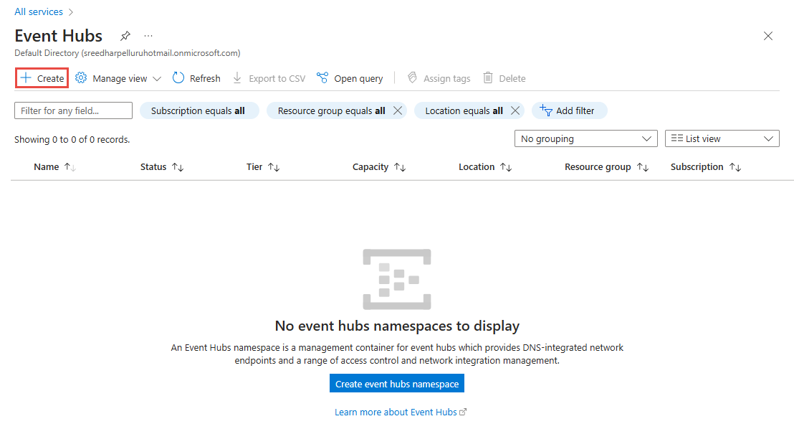
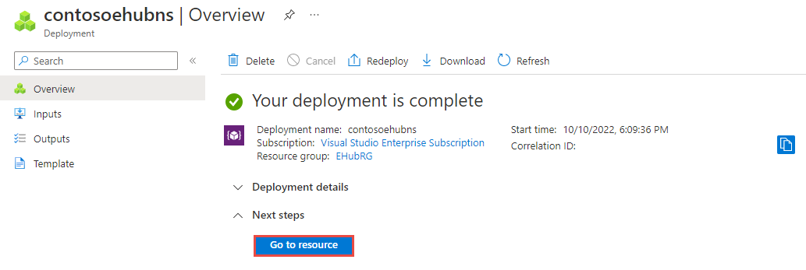
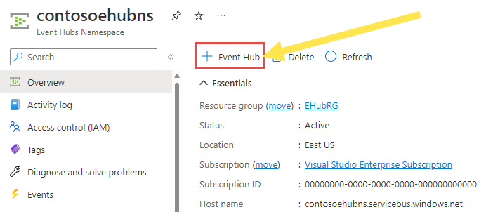
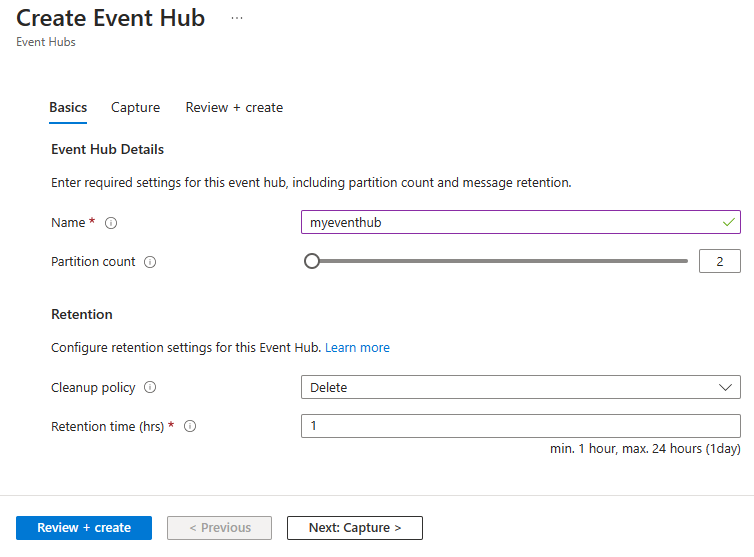
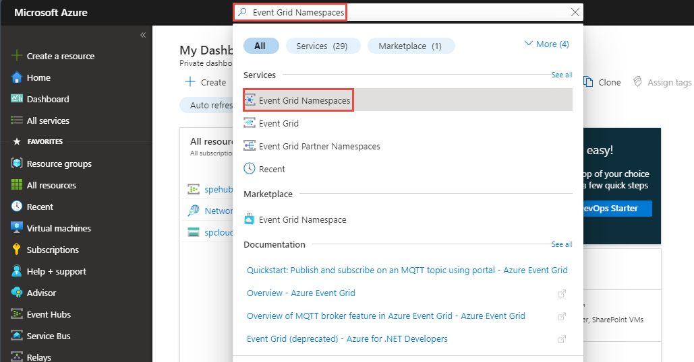
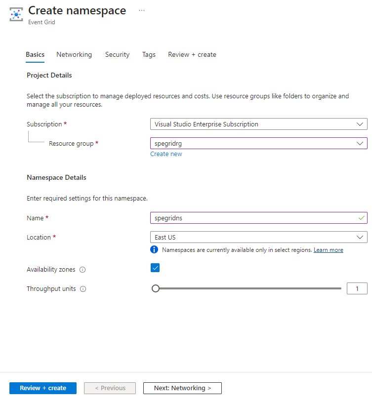
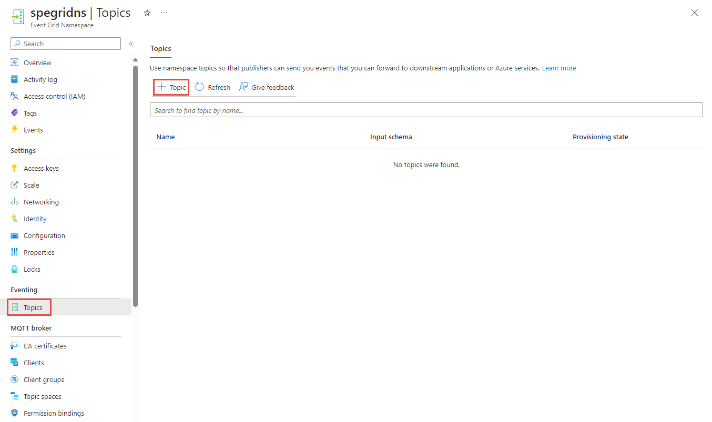
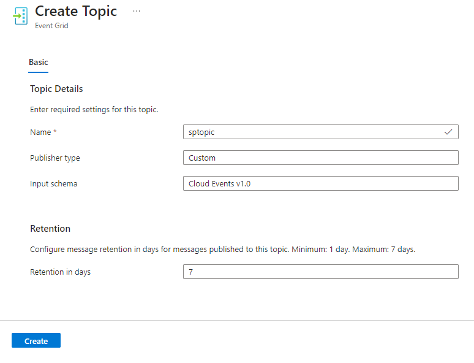
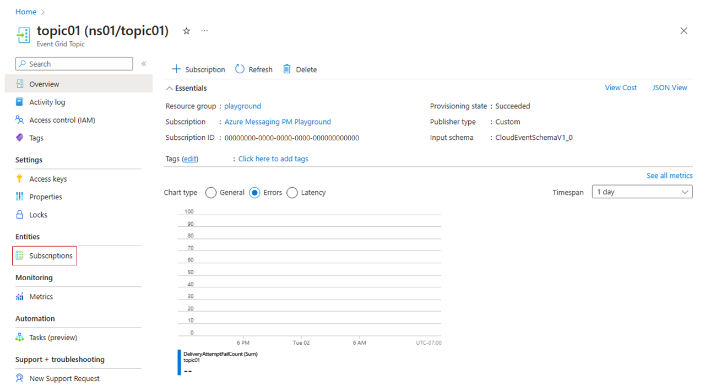
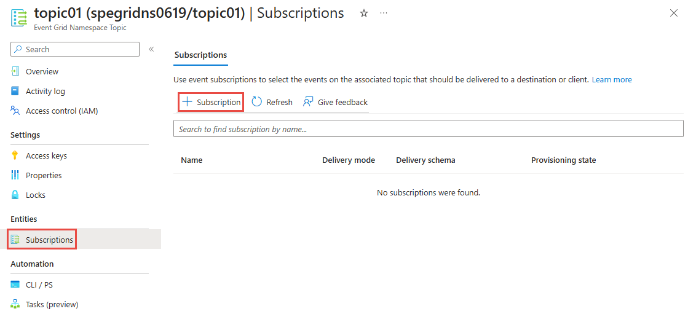

# Azure Integration Services Workshop

## Azure Event Grid – Hands-On Guide

Azure Event Grid is an event routing service that enables reactive, event-driven architectures. In this exercise, you will set up a custom Event Grid Topic, subscribe an Azure Function to it, and send a test event. This demonstrates how to use Event Grid to loosely couple event producers and consumers.

### Skill Objective: Event Grid

Learn to create a custom event stream and subscribe services to it. You will create an Event Grid Topic, configure a subscriber (Function), and publish a test event to observe end-to-end event handling.

## Guide Steps

### Step 1

Create an Azure Event Hubs Namespace – In the Azure portal, select All services in the left menu, and select Event Hubs in the Analytics category.


On the Event Hubs page, select Create on the toolbar.



On the Create namespace page, take the following steps:

1. Select the subscription in which you want to create the namespace.

1. Select the resource group.

1. Enter a name for the namespace. The system immediately checks to see if the name is available.

1. Select a location (region) for the namespace.

1. Choose Basic for the pricing tier.

1. Leave the other settings as default.

1. Select **Review + Create** at the bottom of the page.




Once validation passes, select **Create**. The namespace will be created in a few minutes.

### Step 2

Create an Event Hub – After the namespace is created, go to the new Event Hubs Namespace resource. In the left menu, select Event Hubs under Entities, then click + Event Hub.




Type a name for your event hub, then select **Review + create**.



### Step 3

Create a Custom Event Grid Namespace – In Azure portal, search for Event Grid Namespaces and select + Create.




In the creation pane, choose your subscription and resource group, then enter a unique name for the namespace (it will form part of an URL) and a region. Under the **Security** tab, ensure that System assigned identity is **Enabled**. This allows Event Grid to authenticate with other Azure services securely.

Select **Review + create**. Once validation is successful, click on **Create**. Once deployment finishes, go to the new resource.



### Step 4

Allow Event Grid to access the Event Hub – In the Event Grid Namespace, go to the Access control (IAM) tab. Click on + Add > Add role assignment.

Click on **Azure Event Hubs Data Sender** and select **Next**. In the Assign access to, select **Managed identity**. In Members, click the **+ Select members**. Then, in the right hand pane, select Event Grid Namespace in the Managed identity dropdown, and select the managed identity of the Event Grid Namespace. Click **Select**, then **Review + assign**, and again click **Review + assign**.

### Step 5

Create a Custom Event Grid Topic – In Azure portal of the newly created Event Grid Namespace, select Event Broker > Topics on the left menu and select + Topic.



In the creation pane, enter a name for the topic, leave the other options as is. Select **Create**.



Once deployment finishes, go to the new Event Grid Topic resource.

### Step 6

Subscribe an Endpoint to the Topic – We need an event handler to receive events from this topic.

On the Event Grid Topic page, click Entities > Subscriptions. Then click + Subscription.





Give the subscription a name and choose Push as the Delivery mode. Select the endpoint type as **Event Hub** and configure the endpoint to pick your Event Hub Namespace and Event Hub that should handle events. Ensure that that managed identity type is set to **System assigned**.

Click on **Create**. This sets up the subscription so that any events sent to this topic will be forwarded to the specified Event Hub.

### Step 7

Publish a Test Event – To test the flow, we will manually publish an event to our new topic. One way is via Azure CLI in the Cloud Shell. For example, open the Cloud Shell and run the following commands (assuming Bash and Azure CLI):

```bash
# (just to verify the subscription exists, optional)
topic='<YourTopicName>'
ns='<YourNamespaceName>'
rg='<YourResourceGroup>'
az eventgrid namespace topic event-subscription list --namespace-name $ns --topic-name $topic -g $rg
```

> NOTE: If you are prompted to install an extension for eventgrid, > please confirm by typing `Y`.

Then send an event:

```bash
endpoint="https://"$(az eventgrid namespace show --namespace-name $ns -g $rg --query topicsConfiguration.hostname -o tsv)"/topics/"$topic":publish?api-version=2023-06-01-preview"
key=$(az eventgrid namespace list-key -g $rg --namespace-name $ns --query key1 -o tsv)
event=' { "specversion": "1.0", "id": "'"$RANDOM"'", "type": "com.yourcompany.order.ordercreatedV2", "source" : "/mycontext", "subject": "orders/O-234595", "time": "'`date +%Y-%m-%dT%H:%M:%SZ`'", "datacontenttype" : "application/json", "data":{ "orderId": "O-234595", "url": "https://yourcompany.com/orders/o-234595"}} '
curl -X POST -H "Content-Type: application/cloudevents+json" -H "Authorization:SharedAccessKey $key" -d "$event" $endpoint
```

### Step 8

Navigate to the Event Hubs Namespace page in the Azure portal, refresh the page and verify that incoming messages counter in the chart indicates that an event has been received.


### Step 9

Optional: Create an Azure Function to Process Events – If you want to see how to process these events, you can create an Azure Function that listens to the Event Grid or the Event Hub. In the Azure portal, create a new Function App (similar to the previous exercise), and add a new function with an Event Grid trigger or an Event Hub trigger. The function will automatically be triggered whenever a new event is published.

[Event Grid Function Trigger Documentation](https://learn.microsoft.com/en-us/azure/azure-functions/functions-bindings-event-grid-trigger?tabs=csharp)

[Event Hubs Function Trigger Documentation](https://learn.microsoft.com/en-us/azure/azure-functions/functions-bindings-event-hubs?tabs=csharp)

## Conclusion

Through this exercise, you have configured an event-driven flow using Event Grid. You saw how to define a custom topic as an event source, and set up a subscription so that an Azure Function reacts to events on that topic. Event Grid decouples the sender and receiver – the sender doesn’t need to know about the function; it just emits events to the topic. This is powerful for building scalable, reactive integration patterns (e.g., triggering workflows when new files are uploaded, or broadcasting business events to multiple consumers).
