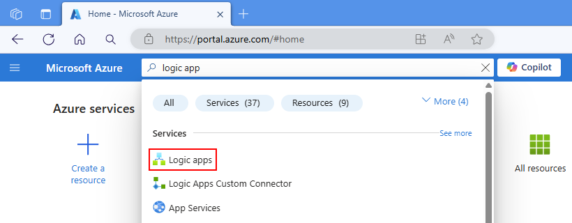
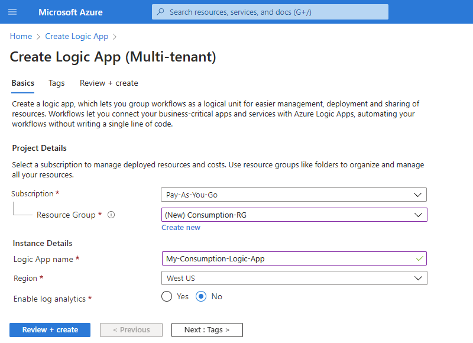
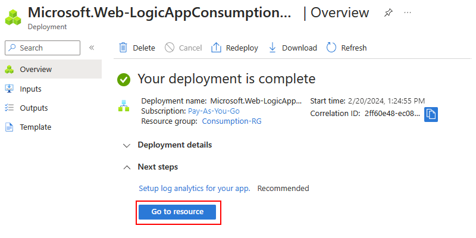
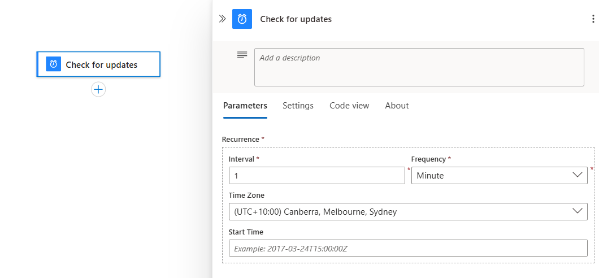
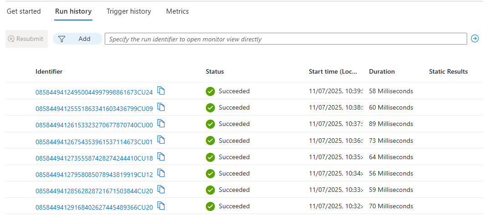

# Azure Integration Services Workshop

## Azure Logic Apps – Hands-On Guide

Azure Logic Apps enable you to orchestrate workflows that integrate various services without writing code. In this guide, you will create a logic app that triggers on a schedule and performs an action. This teaches the core concepts of triggers and actions in Logic Apps.

### Skill Objective: Logic Apps

Learn to build an automated workflow with a trigger and actions. This includes configuring a trigger (event or schedule) and adding steps such as sending an email or calling an API in a logic app.

## Guide Steps

### Step 1

Create a Logic App Resource – In the Azure portal, create a new Logic App (Consumption plan) resource. (Search for "Logic App" and select Add).

Choose the Consumption plan for a simple scenario. Provide a name and resource group, then create the logic app. Your settings should look similar to the following example.

Once deployed, navigate to the Logic App designer.

### Step 2

Define a Trigger – Every logic app starts with a trigger that fires the workflow. In the designer, select a trigger. 

1. On the workflow designer, [follow these general steps to add the **Schedule** trigger named **Recurrence**](create-workflow-with-trigger-or-action.md?tabs=consumption#add-trigger).

1. Rename the **Recurrence** trigger with the following title: **Check for updates**.

1. In the trigger information box, provide the following information:

   | Parameter | Value | Description |
   |-----------|-------|-------------|
   | **Interval** | 1 | The number of intervals to wait between checks |
   | **Frequency** | Minute | The unit of time to use for the recurrence |

1. Save your workflow. On the designer toolbar, select **Save**.

Your logic app resource and updated workflow are now live in the Azure portal. However, the workflow only triggers based on the specified schedule and doesn't perform other actions. So, add an action that responds when the trigger fires.

### Step 3

Add an Action – After the trigger, add actions that the logic app will perform.

Let’s have the logic app send an email for each run (simulating an alert).

1. Click + New step and choose an action.

1. Select the Office 365 Outlook Send an email action (you’ll be prompted to sign in to an Outlook or Office 365 account). 

1. Configure the email recipient, subject, and body. You can use outputs from previous steps in later actions; in our simple case, just put a static message like “Logic App run at @{utcNow()}” to include a timestamp. This demonstrates using connectors – here the Outlook connector – to perform work.

Note: If you don’t have an Office 365 account, you could choose an alternative action such as a Teams message or writing to an Azure Storage for the sake of practice. The key is to integrate at least one external service in the workflow. Each action you add uses a connector under the hood to talk to that service. (Logic Apps has 1000+ connectors for various services).

### Step 4

Save and Run – Click Save to deploy the workflow. For a Recurrence trigger, the Logic App will run automatically on schedule.

You can also trigger it manually for testing: on the designer toolbar, use Run > Run.

Check the Runs history in the Logic App overview — you should see a successful run entry. Clicking on it will show a timeline of steps: the trigger and the email action. If the action succeeded, verify that the email was sent (check the inbox of the configured recipient). Each run’s details confirm that the workflow executed as designed.

## Conclusion

You have now created a logic app that periodically performs a task (sending an email). This exercise showcased how to configure a trigger (schedule) and add actions using connectors (Outlook email). Through hands-on practice, you learned how Logic Apps enable integration of services (like RSS to email, database to Teams, etc.) by configuring steps in a visual workflow, with no custom code needed.
