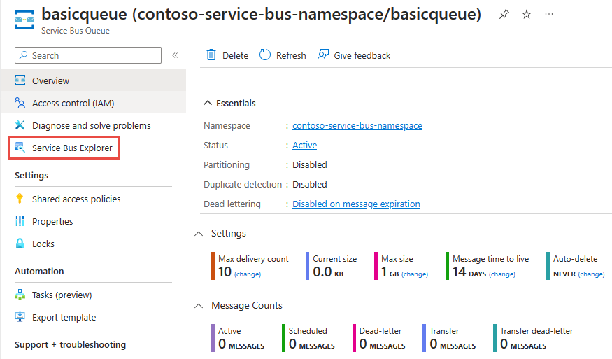
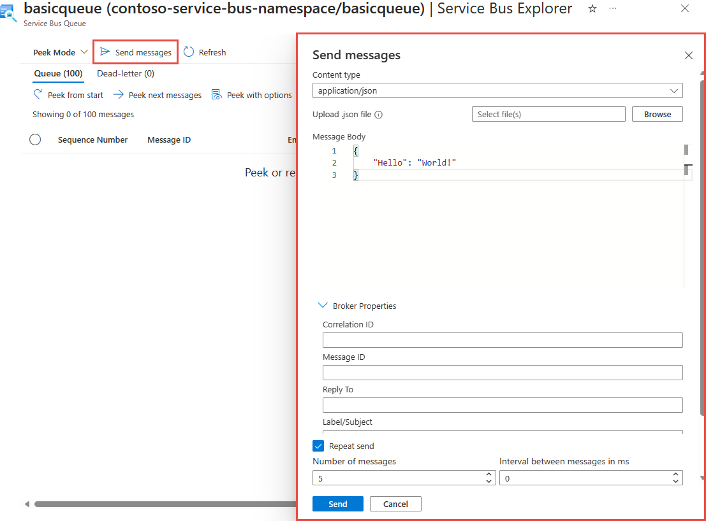
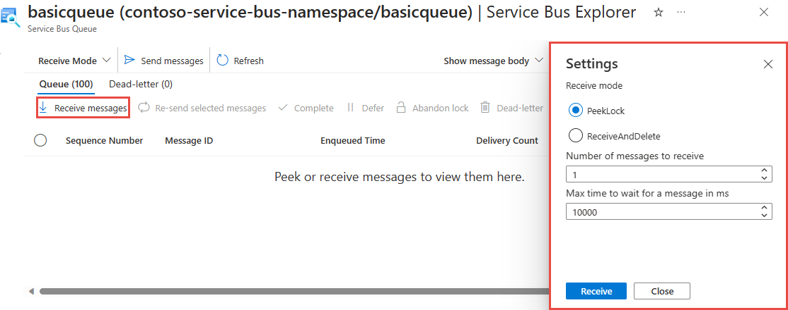

# Azure Integration Services Workshop

## Azure Service Bus – Hands-On Guide

Azure Service Bus is a message queuing service for enterprise integration, enabling reliable messaging between services. In this guide, you’ll create a Service Bus namespace and queue, and learn how to send and receive messages using the built-in Service Bus Explorer tool. This covers the basics of queued messaging in integration scenarios.

> [NOTE]
> This article highlights the functionality of the Azure Service Bus Explorer that's part of the Azure portal.
>
> The community owned [open source Service Bus Explorer](https://github.com/paolosalvatori/ServiceBusExplorer) is a standalone application and is different from this one.

### Skill Objective: Service Bus

Learn to provision a message queue and exchange messages. You will create a Service Bus namespace with a queue, then use the Service Bus Explorer to send a test message and receive it, demonstrating decoupled communication.

## Guide Steps

### Step 1

Create a Namespace and Queue – In the Azure portal, create a Service Bus Namespace (search and select + Create for Service Bus). Choose a unique name and the region, and select a pricing tier (Basic or Standard).

Note: The Standard tier is needed if you want topics/subscriptions.

Select **Review and create** at the bottom of the page.

Once created, open the namespace. Now, create a queue in this namespace: under Entities in the namespace blade, select Queues and click + Queue. Provide a name for the queue (e.g., “myqueue”) and leave defaults for max size etc., then press **Create**. You now have a queue, which will buffer messages sent to it.

### Step 2

Send a Test Message – The Azure Portal includes Service Bus Explorer functionality to test queues. In the namespace, go to your queue and select Service Bus Explorer from the side menu.

Choose Send mode in the explorer. Input some message content in the message body (for example, {"Hello": "World!"} or even a simple text). Optionally set the content type (e.g., application/json if you sent JSON). Then click the Send button. If the send is successful, you’ll see the active message count on the queue increment by 1.

Behind the scenes, this simulates a producer application placing a message onto the queue.

### Step 3

Receive (or Peek) the Message – Still in Service Bus Explorer, switch to Peek or Receive mode to retrieve messages. Using Peek will look at the messages without removing them, whereas Receive will dequeue them.

Select Peek from start to see the first 100 messages in the queue. The message you sent should appear in the list with its content. If you use Receive, you can specify a number of messages to fetch and a mode (peek-lock or delete). For example, select Receive mode, choose to receive 1 message and Receive.

### Step 4

In ReceiveAndDelete mode, that message would be removed from the queue immediately. Use ReceiveAndDelete to consume the message. After receiving, you should see the message content displayed, and the queue’s message count will decrement if it was removed.

### Step 5

Optional: View [Service Bus Explorer Documentation](https://learn.microsoft.com/azure/service-bus-messaging/service-bus-explorer) for more advanced features like dead-letter queues, message deferral, and scheduled messages. This tool is powerful for managing and testing Service Bus entities.

Try exploring the various features of Service Bus Explorer, such as:

- **Dead-letter queues**: View messages that could not be delivered.
- **Message deferral**: Temporarily set messages aside for later processing.
- **Scheduled messages**: Send messages to be delivered at a future time.

## Conclusion

You have now sent and received a message via Azure Service Bus. This hands-on practice illustrates the concept of decoupled communication: one component can send messages to the queue, and another can process them asynchronously. The Service Bus guarantees delivery and ordering (FIFO for a single queue). In real integrations, Service Bus might connect microservices or serve as a buffer between producers (e.g., Logic Apps or APIs) and consumers (Functions, etc.), improving reliability and scalability of the system.
